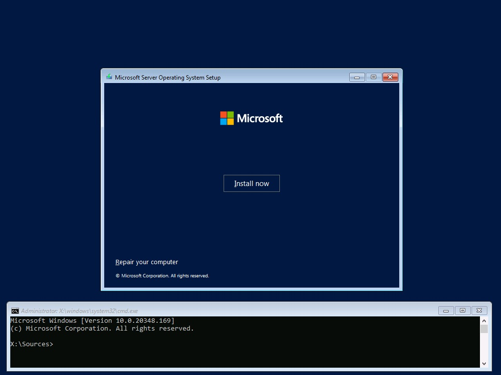

# About the Windows Recovery Media (and Bare Metal Restore)

Any modern Windows installation can create a "Recovery Drive" containing utilities to troubleshoot and possibly restore the system. Subject to Microsoft's restrictions, the target of the Bare Metal Restore can be different hardware, making the "Recovery Drive" a valuable tool.

There are caveats:
1. The Recovery Drive utility creator MAY not include all OEM drivers, in particular critical RAID and network drivers required to access the system itself or the system backup.

2. It may not be possible to slipstream these drivers into the Recovery Media Windows image : the DISM utility will not update WIM files larger than 4GB (split across multiple .SWM files).

3. There are issues accessing iSCSI disks containing these backups. The Windows "Installation Media" (ISO, DVD, USB key) cannot be used in lieu of the "Recovery Drive" because the MSiSCSI service is not configured in this environment and utilities such as iscsicli are not available on the "Installation Media".

4. Beginning with Windows 11 and Windows Server 2022, the MSiSCSI service will not start in the Windows PE environment used by the "Recovery Drive". This is documented in Microsoft Case #2304230060000186. A workaround is required to start MSiSCSI. See below for more information.

The focus of this project is to use the Microsoft utilities as is to configure a "Recovery Drive" and achieve the troubleshooting and/or bare metal restore required by your situation.

Windows Server Backup or one of its workstation variants (Windows Backup, System Image Backup, etc.) is used to create the system image required to restore the system: this is not covered here.

There are two scripts in this project:
1. SetUpOEMRecovery will create/update a "Recovery Drive" for the system at hand. The script creates a DRIVERS directory in the root of the "Recovery Drive" and dumps all OEM drivers there. It then copies itself as well as the PnPUtil.exe utility, a recovery helper script (and an empty Windows XML Event Log, documented below).

2. RECOVER.CMD is the helper script that will configure the Windows PE environment in order to access (hopefully) all system components and perform a Bare Metal Restore, if need be. This includes initializing the network stack in Windows PE, starting required services such as MSiSCSI and the DNS client, and starting the disk configuration utility. As a convenience, the script will also launch BMRUI.EXE, the "Bare Metal Restore" utility: this utility is only vailable in the Windows PE environment. 

Note: The Windows XML Event Log (EVTX) format is documented in *[Windows XML Event Log (EVTX) format](https://github.com/libyal/libevtx/blob/main/documentation/Windows%20XML%20Event%20Log%20(EVTX).asciidoc)*. The Windows PE environment has no utility to create an empty event file. If you don't want to use the binary file provided with this project, you can copy any log from the %SystemRoot%\System32\WinEVT\Logs that has the minimum size of 69 632 bytes under the name Empty.evtx in the same directory as the above two scripts. On startup, RECOVER.CMD will display the headers of whatever file it will supply to the Event logger service.

# SetUpOEMRecovery

## Purpose:

Create a UEFI or MBR recovery media on a USB key containing the OEM drivers installed on the system. 
 
Drivers may be collected from multiple systems to allow using a single USB key for their maintenance.

Options allow
 removal of DISPLAY, MEDIA, BLUETOOTH, PRINTER, SOFTWARECOMPONENT drivers as well as vey large drivers (typically
 wireless NICs). These drivers are generally useless in the Windows PE environment.

The script also copies support files to initiate a bare metal restore of the system once booted
from the recovery key. This is a companion project.

------
>**Caution:**	This script requires **elevated** execution privileges.

Quoting from Microsoft's "about_Execution_Policies" : "PowerShell's
execution policy is a safety feature that controls the conditions
under which PowerShell loads configuration files and runs scripts."

Use any configuration that is the equivalent of the
following commnand executed from an elevated PowerShell prompt:

			Set-ExecutionPolicy -Scope CurrentUser -ExecutionPolicy Unrestricted
------

## Operation:

- [ ] Open an elevated PowerShell prompt.
- [ ] Invoke the script, insert a USB key and press enter. The script will prompt for a USB key until a compatible device is inserted.
- [ ] The script scans compatible USB drives for a ?:\sources\Reconstruct.WIM windows image file. If no such file is found, the script invokes the Microsoft RecoveryDrive utility. You have the option to reinitialize an existing recovery drive. Note that this utility will enumerate 'Fixed' and 'Removable' drive types, not just the selected drive. This process is repeated until a single compatible drive is identified. 
- [ ] The script dumps all OEM drivers in the ?:\Drivers directory of the USB drive. You have the option to remove drivers that are not usually used in the Windows PE environment.
- [ ] The script copies itself, the RECOVER.CMD script, and the Empty.evtx file in the root of the USB drive. These files must be in th same directory.
- [ ] An enumeration of all OEM drivers present on the drive is displayed

			
Here is a sample output (with additional comments):

```
	Windows PowerShell
	Copyright (C) Microsoft Corporation. All rights reserved.
	Install the latest PowerShell for new features and improvements! https://aka.ms/PSWindows    

	PS C:\Users\<WhoAmI>> cd .\Desktop\
	PS C:\Users\<WhoAmI>\Desktop> .\SetUpOEMRecovery.ps1                                               
	Microsoft Windows NT 10.0.22631.0

	Make sure a Microsoft RecoveryDrive compatible USB drive is connected and press RETURN to continue:
```

The USB drive size is validated against the requirement of your Windows build number. You may be offered to reinitialize the USB drive. In any case, a valid Recovery drive is required to continue:

```
	WARNING: The Microsoft RecoveryDrive utility will enumerate 'Fixed' and 'Removable' drive types.

	DriveLetter FriendlyName FileSystemType DriveType HealthStatus OperationalStatus SizeRemaining     Size
	----------- ------------ -------------- --------- ------------ ----------------- -------------     ----
	E           SeaGlassUSB  FAT32          Removable Healthy      OK                     58.19 GB 58.19 GB


	Press RETURN to invoke the RecoveryDrive creator:
```


```
	Make sure a Microsoft RecoveryDrive compatible USB drive is connected and press RETURN to continue:
	WARNING: The Microsoft RecoveryDrive utility will enumerate 'Fixed' and 'Removable' drive types.

	DriveLetter FriendlyName FileSystemType DriveType HealthStatus OperationalStatus SizeRemaining     Size
	----------- ------------ -------------- --------- ------------ ----------------- -------------     ----
	E           RECOVERY     FAT32          Removable Healthy      OK                      24.7 GB 31.99 GB


	Enter 'Yes' to reinitialize this Recovery Drive (E:), anything else to continue:
```

As shown above, the Recovery drive creator has reformatted a 64GB USB drive into a BIOS/UEFI compatible drive. The next step is to dump to this drive all OEM drivers and retain only what could be used in the Windows PE environment.

```
	Updating drive E: with OEM drivers from this system.


		Directory: E:\


	Mode          LastWriteTime Length Name
	----          ------------- ------ ----
	d----- 2024-01-31   3:01 PM        Drivers

	WARNING: Skipping E:\Drivers\en-GB\PnPUtil.exe.mui
	Microsoft PnP Utility

	Exporting driver package:   oem1.inf (backupreaderdriver.inf)
	Driver package exported successfully.

	Exporting driver package:   oem0.inf (usbaapl64.inf)
	Driver package exported successfully.

	Exporting driver package:   oem5.inf (vhusb3hc.inf)
	Driver package exported successfully.

	Exporting driver package:   oem2.inf (netaapl64.inf)
	Driver package exported successfully.

	Exporting driver package:   oem4.inf (prnms001.inf)
	Driver package exported successfully.

	Exporting driver package:   oem3.inf (prnms009.inf)
	Driver package exported successfully.

	Total driver packages:      6
	Exported driver packages:   6
	WARNING: These drivers are probably useless in the Windows PE environment:
	WARNING:   @{Driver=E:\Drivers\prnms001.inf_amd64_cf4b76d3d4b6330c; Class=PRINTER}
	WARNING:   @{Driver=E:\Drivers\prnms009.inf_amd64_3107874c7db0aa5a; Class=PRINTER}
	Enter 'Yes' to remove these drivers, anything else to continue: Yes

	Available OEM drivers on this recovery media:
	---------------------------------------------


		Directory: E:\Drivers


	Mode          LastWriteTime Length Name
	----          ------------- ------ ----
	d----- 2024-01-31   3:01 PM        en-US
	d----- 2024-01-31   3:01 PM        en-GB


	Name                                          LastWriteTime
	----                                          -------------
	backupreaderdriver.inf_amd64_6d9ee52c85e3cad1 2024-01-31 3:01:00 PM
	en-GB                                         2024-01-31 3:01:00 PM
	en-US                                         2024-01-31 3:01:00 PM
	netaapl64.inf_amd64_56f23639c9617984          2024-01-31 3:01:00 PM
	usbaapl64.inf_amd64_c0e4d8c2aef471b7          2024-01-31 3:01:00 PM
	vhusb3hc.inf_amd64_956cd640c9138cd4           2024-01-31 3:01:00 PM


	Done!

```

# Recover.CMD

## Purpose:

Configure at runtime the target system in order to access the network and optionnaly perform a Bare Metal Restore.

## Operation

Upon successful booting, the Windows Recovery Environment menu is displayed. At a minimum, troubleshooting options are always available:


In order to configure the system, we need to access a command prompt:


The Windows PE is running from a RAM disk labeled X:\ and does not provide a variable pointing to the real boot drive.

Issue the command { **mountvol | find ":\\"** } (without the braces ;-) and find the RECOVER.CMD script.

The script presumes the system is connected to a network but does not presume any particular configuration other than Automatic IP Addressing in the absence of a DHCP server. In the following example, the system under test is connected directly to a NAS using a network cable.

You have the option to install the OEM drivers stored on the USB drive.

You should review the disk configuration before continuing. In particular, some Bare Metal Restore fail even if you are restoring the backup of the original system. In this instance, it is better to "clean" the partition table before attempting the Bare Metal Restore.

You have the option to connect to a iSCSI target by specifying its name (preferred) or IP address. The script will enumerate all available targets and you will need to select one.

Finally, the script will start the BMRUI utility to allow restoring from either a local source (including iSCSI) or a remote share.

You can abort and restart the script at any time.

Here is a sample log:

```
	Microsoft Windows [Version 10.0.22621.2861]
	(c) Microsoft Corporation. All rights reserved.

	X:\Windows\System32>mountvol | find ":\"
			C:\
			D:\
			X:\

	X:\Windows\System32>d:\Recover.cmd

	Recovery Drive: d:\
	-------------------

	The Windows Event Log service is stopping.
	The Windows Event Log service was stopped successfully.

			1 file(s) copied.
			1 file(s) copied.
	The Windows Event Log service is starting.
	The Windows Event Log service was started successfully.

	The Windows Time service is starting.
	The Windows Time service was started successfully.


	HKEY_LOCAL_MACHINE\SYSTEM\CurrentControlSet\Control\TimeZoneInformation
		TimeZoneKeyName    REG_SZ    Pacific Standard Time

	Wed 02/07/2024  6:13:11.08

	creationTime: 2024-02-07T14:13:14.1632334Z
	lastAccessTime: 2024-02-07T14:13:14.1632334Z
	lastWriteTime: 2023-06-30T22:43:42.0000000Z
	fileSize: 69632
	attributes: 32
	numberOfLogRecords: 0
	oldestRecordNumber: 0

	creationTime: 2024-02-07T14:13:14.1632334Z
	lastAccessTime: 2024-02-07T14:13:14.1632334Z
	lastWriteTime: 2023-06-30T22:43:42.0000000Z
	fileSize: 69632
	attributes: 32
	numberOfLogRecords: 0
	oldestRecordNumber: 0

	Do you want to install the OEM drivers present on the recovery drive?
	Enter "Yes" (case sensitive) to install, anything else list installed OEM drivers:

	Microsoft PnP Utility

	Published Name:     oem1.inf
	Original Name:      backupreaderdriver.inf
	Provider Name:      Microsoft
	Class Name:         System
	Class GUID:         {4d36e97d-e325-11ce-bfc1-08002be10318}
	Driver Version:     08/17/2012 6.2.9190.0
	Signer Name:        Microsoft Windows Hardware Compatibility Publisher

	Published Name:     oem0.inf
	Original Name:      usbaapl64.inf
	Provider Name:      Apple, Inc.
	Class Name:         USB
	Class GUID:         {36fc9e60-c465-11cf-8056-444553540000}
	Driver Version:     05/19/2017 6.0.9999.69
	Signer Name:        Microsoft Windows Hardware Compatibility Publisher

	Published Name:     oem2.inf
	Original Name:      netaapl64.inf
	Provider Name:      Apple
	Class Name:         Net
	Class GUID:         {4d36e972-e325-11ce-bfc1-08002be10318}
	Driver Version:     07/15/2013 1.8.5.1
	Signer Name:        Microsoft Windows Hardware Compatibility Publisher


	Network Initialization:
	-----------------------

	The DNS Client service is starting.
	The DNS Client service was started successfully.


	The command completed successfully.

	Windows IP Configuration

	   Host Name . . . . . . . . . . . . : minint-03nlk09
	   Primary Dns Suffix  . . . . . . . :
	   Node Type . . . . . . . . . . . . : Hybrid
	   IP Routing Enabled. . . . . . . . : No
	   WINS Proxy Enabled. . . . . . . . : No

	Ethernet adapter Ethernet:

	   Connection-specific DNS Suffix  . :
	   Description . . . . . . . . . . . : Intel(R) Ethernet Connection I219-LM
	   Physical Address. . . . . . . . . : 54-B2-03-8B-D6-97
	   DHCP Enabled. . . . . . . . . . . : Yes
	   Autoconfiguration Enabled . . . . : Yes
	   Link-local IPv6 Address . . . . . : fe80::f92a:1d8f:7338:34b4%3(Preferred)
	   Autoconfiguration IPv4 Address. . : 169.254.169.33(Preferred)
	   Subnet Mask . . . . . . . . . . . : 255.255.0.0
	   Default Gateway . . . . . . . . . :
	   DHCPv6 IAID . . . . . . . . . . . : 55882243
	   DHCPv6 Client DUID. . . . . . . . : 00-01-00-01-2D-55-7D-6A-54-B2-03-8B-D6-97
	   DNS Servers . . . . . . . . . . . : fec0:0:0:ffff::1%1
										   fec0:0:0:ffff::2%1
										   fec0:0:0:ffff::3%1
	   NetBIOS over Tcpip. . . . . . . . : Enabled

	Confirm that the network is configured correctly or press (Ctrl)C to drop the connection to a network disk:

	The Microsoft iSCSI Initiator Service service is starting.
	The Microsoft iSCSI Initiator Service service was started successfully.


	Enter the iSCSI server (IP address or hostname):

	Review the configuration of disks and partitions (finish with the 'exit' command):

	Microsoft DiskPart version 10.0.22621.1

	Copyright (C) Microsoft Corporation.
	On computer: MININT-1MI9VCS

	DISKPART> list disk

	  Disk ###  Status         Size     Free     Dyn  Gpt
	  --------  -------------  -------  -------  ---  ---
	  Disk 0    Online          931 GB   804 GB        *
	  Disk 1    Online           58 GB    26 GB

	DISKPART> select disk 0

	Disk 0 is now the selected disk.

	DISKPART> list partition

	  Partition ###  Type              Size     Offset
	  -------------  ----------------  -------  -------
	  Partition 1    System              99 MB  1024 KB
	  Partition 2    Reserved            16 MB   100 MB
	  Partition 3    Primary            125 GB   116 MB
	  Partition 4    Recovery           989 MB   126 GB

	DISKPART> list volume

	  Volume ###  Ltr  Label        Fs     Type        Size     Status     Info
	  ----------  ---  -----------  -----  ----------  -------  ---------  --------
	  Volume 0     C                NTFS   Partition    125 GB  Healthy
	  Volume 1                      FAT32  Partition     99 MB  Healthy    Hidden
	  Volume 2         Recovery     NTFS   Partition    989 MB  Healthy    Hidden
	  Volume 3     D   RECOVERY     FAT32  Removable     32 GB  Healthy

	DISKPART> exit

	Leaving DiskPart...

	Available Discs:
		\\?\Volume{0753c7f3-d90f-44fd-b04c-14851c22b261}\
			C:\
		\\?\Volume{80c4f4c4-79dc-4370-a8c7-a3e9a67bb7d5}\
		\\?\Volume{cdf86763-c5c2-11ee-935f-806e6f6e6963}\
			D:\
		\\?\Volume{377012df-46a8-47d5-8a58-ce4d000e6659}\
		\\?\Volume{d9b257fc-684e-4dcb-ab79-03cfa2f6b750}\
			X:\

	X:\Windows\System32>

```

When a iSCSI server is specified, the iSCSI target must also be specified:

```
	Enter the iSCSI server (IP address or hostname): dragons
	Microsoft iSCSI Initiator Version 10.0 Build 22621

	The operation completed successfully.

	Microsoft iSCSI Initiator Version 10.0 Build 22621

	Targets List:
		iqn.2013-03.com.wdc:dragons:stoic-vol1
		iqn.2013-03.com.wdc:dragons:toothless-vol1
		iqn.2013-03.com.wdc:dragons:hiccup-vol1
		iqn.2013-03.com.wdc:dragons:astrid-vol1
	The operation completed successfully.

	Enter the iSCSI target: iqn.2013-03.com.wdc:dragons:hiccup-vol1
	Microsoft iSCSI Initiator Version 10.0 Build 22621

	Session Id is 0xffff8188cd3ff010-0x4000013700000002
	Connection Id is 0xffff8188cd3ff010-0x1
	The operation completed successfully.

	Wait for iSCSI disk integration into Windows configuration (60 seconds)

```

and the target will be shown in the DISKPART output, such as:

```
	DISKPART> list disk

	  Disk ###  Status         Size     Free     Dyn  Gpt
	  --------  -------------  -------  -------  ---  ---
	  Disk 0    Online          931 GB   804 GB        *
	  Disk 1    Online           58 GB    26 GB
	  Disk 2    Online          357 GB   131 MB        *

	DISKPART> list volume

	  Volume ###  Ltr  Label        Fs     Type        Size     Status     Info
	  ----------  ---  -----------  -----  ----------  -------  ---------  --------
	  Volume 0     C                NTFS   Partition    125 GB  Healthy
	  Volume 1                      FAT32  Partition     99 MB  Healthy    Hidden
	  Volume 2         Recovery     NTFS   Partition    989 MB  Healthy    Hidden
	  Volume 3     D   RECOVERY     FAT32  Removable     32 GB  Healthy
	  Volume 4         Hiccup 2020  NTFS   Partition    357 GB  Healthy

```

# A note regarding the MSiSCSI service in Windows PE builds 20348 and later

Beginning with build 20348 (Windows 11 / Windows Sever 2022), starting the MSiSCSI service in Windows PE will fail with error 5 (access denied).

<details>

<summary>Demonstrate MSiSCSI failure in the WinRE environment</summary>

### Demonstrate MSiSCSI failure in the WinRE environment

This example uses Windows Server 2022.

Restart the server into the WinRE environment using Shift-Restart: 

Select "Troubleshoot": 

Select "Command Prompt": 

Verify with ipconfig that a network adapter is active and start MSiSCSI: the command fails with Error 5, Protection Violation running under the System principal: 

</details>

<details>

<summary>Demonstrate MSiSCSI failure from the Windows Installation Media</summary>

### Demonstrate MSiSCSI failure from the Windows Installation Media

This example uses Windows Server 2022.

Boot the distribution media: 

Drop to a command prompt ushing Shift-F10: 

Verify with ipconfig that a network adapter is active and start RegEdit. Verify that the MSiSCSI is not part of the configuration: 

</details>

For some reason, the service appears to validate the Event Log service configuration and will issue this error if the System.evtx is not available. The service will also fail with error 2 (file not found) if the Application.evtx log file is not available.

As a simple workaround, the EventLog service is stopped, an empty log file of minimum size is copied under both names and the EventLog service is started.

In order to provide coherent time references, the W32Time service is also started and the headers of both event logs are displayed, for sanity reasons.

Note that stopping the W32Time service will also result in error 2 (File not Found): you can conclude that some other Event Log file is missing ;-).

You can reuse this code in your own recovery media, with the above copyright.

```
Rem Install temporary workaround for Windows builds 20348 and above
if exist "%~dp0\Empty.evtx" (

	net Stop EventLog

	Copy "%~dp0\Empty.evtx" %SystemRoot%\System32\WinEvt\Logs\System.evtx
	Copy "%~dp0\Empty.evtx" %SystemRoot%\System32\WinEvt\Logs\Application.evtx

	net Start EventLog

	net Start W32Time
	reg Query HKLM\SYSTEM\CurrentControlSet\Control\TimeZoneInformation /v TimeZoneKeyName
	echo %Date% %Time%
	echo.

	wevtutil gli System
	echo.

	wevtutil gli Application
	echo.

	Rem "net stop W32Time" will result in a error 2 (File not found),
	Rem an indication that some other Event log is missing.
 )

```
# Converting a Hyper-V virtual machine to a physical machine

Hyper-V virtual machines have no direct access to removable USB drives.

Using some virtual USB server, you can run the SetUpOEMRecovery script within the virtual machine to create a physical Recovery Drive on the virtual USB server. You can then use this USB drive to boot a physical BIOS/UEFI compatible system and proceed to a bare metal restore of the virtal machine.

This strategy was successfully tested with third party software Virtual Here (https://www.virtualhere.com/). The process involved no modification to the above scripts, no modfication to the virtual machine and no modification to the workstation hosting the Recovery Drive. Your mileage may vary. 


