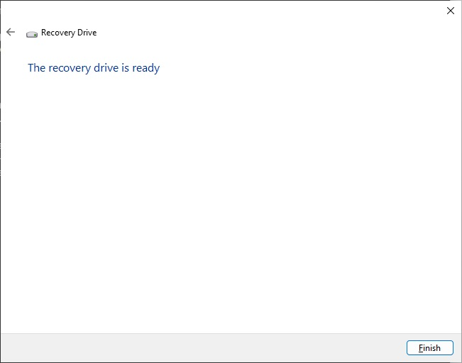

# About the Windows Recovery Media (and Bare Metal Restore)

Any modern Windows installation can create a "Recovery Drive" containing utilities to troubleshoot and possibly restore the system. Subject to Microsoft's restrictions, the target of the Bare Metal Restore can be different hardware, making the "Recovery Drive" a valuable tool.

There are caveats:
1. The Recovery Drive utility creator does not include all OEM drivers, in particular critical RAID and network drivers required to access the system itself or the system backup.

2. It may not be possible to slipstream these drivers into the Recovery Media Windows image : the DISM utility will not update WIM files larger than 4GB (split across multiple .SWM files).

3. There are issues accessing iSCSI disks containing these backups. The Windows "Installation Media" (ISO, DVD, USB key) cannot be used in lieu of the "Recovery Drive" because the MSiSCSI service is not configured in this environment and utilities such as iscsicli are not available on the distribution media.

4. Beginning with Windows 11 and Windows Server 2022, the MSiSCSI service will not start in the Windows PE environment used by the "Recovery Drive". This is documented in Microsoft Case #2304230060000186. See below for more information.

The focus of this project is to use the Microsoft utilities as is to configure a "Recovery Drive" and achieve the troubleshooting and/or bare metal restore required by the system.

There are two scripts in this project:
1. SetUpOEMRecovery will create/update a "Recovery Drive" for the system at hand. The script creates a DRIVERS directory in the root of the "Recovery Drive" and dumps all OEM drivers there. It then copies itself as well as the PnPUtil.exe utility, a recovery helper script (and an empty Windows XML Event Log, documented below).

2. RECOVER.CMD is the helper script to configure the Windows PE environment in order to access (hopefully) all system components and perform a Bare Metal Restore, if need be.

Note: The Windows XML Event Log (EVTX) format is documented in https://github.com/libyal/libevtx/blob/main/documentation/Windows%20XML%20Event%20Log%20(EVTX).asciidoc. The Windows PE environment has no utility to create an empty event file. If you don't wat to use the binary file provided with this project, you can copy any log from the %SystemRoot%\System32\WinEVT\Logs that has the minimum size of 69 632 under the name Emoty.evtx in the same directory as the above two scripts. On startup, RECOVER.CMD will display the headers of whatever file it will supply to the Event logger service.

# SetUpOEMRecovery

## Purpose:

Create a UEFI or MBR recovery media on a USB key containing the OEM drivers installed on the system. 
 
Drivers may be collected from multiple systems to allow using a single USB key for their maintenance.

Options allow
 removal of DISPLAY, MEDIA, BLUETOOTH, PRINTER, SOFTWARECOMPONENT drivers as well as vey large drivers (typically
 wireless NICs). These drivers are generally useless in the Windows PE environment.

The script also copies support files to initiate a bare metal restore of the system once booted
from the recovery key. This is a companion project.

------
>**Caution:**	This script requires **elevated** execution privileges.

Quoting from Microsoft's "about_Execution_Policies" : "PowerShell's
execution policy is a safety feature that controls the conditions
under which PowerShell loads configuration files and runs scripts."

Use any configuration that is the equivalent of the
following commnand executed from an elevated PowerShell prompt:

			Set-ExecutionPolicy -Scope CurrentUser -ExecutionPolicy Unrestricted
------

## Operation:

- [ ] Open an elevated PowerShell prompt.
- [ ] Invoke the script, insert a USB key and press enter. The script will prompt for a USB key until a compatible device is inserted.
- [ ] The script scans compatible USB drives for a ?:\sources\Reconstruct.WIM windows image file. If no such file is found, the script invokes the Microsoft RecoveryDrive utility. You have the option to reinitialize an existing recovery drive. Note that this utility will enumerate 'Fixed' and 'Removable' drive types, not just the selected drive. This process is repeated until a single compatible drive is identified. 
- [ ] The script dumps all OEM drivers in the ?:\Drivers directory of the USB drive. You have the option to remove drivers that are not usually used in the Windows PE environment.
- [ ] The script copies the RECOVER.CMD file in the root of the USB drive.
- [ ] An enumeration of all OEM drivers present on the drive is displayed

			
Here is a sample output:

```
	Windows PowerShell
	Copyright (C) Microsoft Corporation. All rights reserved.
	Install the latest PowerShell for new features and improvements! https://aka.ms/PSWindows    

	PS C:\Users\<WhoAmI>> cd .\Desktop\
	PS C:\Users\<WhoAmI>\Desktop> .\SetUpOEMRecovery.ps1                                               
	Microsoft Windows NT 10.0.22631.0

	Make sure a Microsoft RecoveryDrive compatible USB drive is connected and press RETURN to continue:
	WARNING: The Microsoft RecoveryDrive utility will enumerate 'Fixed' and 'Removable' drive types.

	DriveLetter FriendlyName FileSystemType DriveType HealthStatus OperationalStatus SizeRemaining     Size
	----------- ------------ -------------- --------- ------------ ----------------- -------------     ----
	E           SeaGlassUSB  FAT32          Removable Healthy      OK                     58.19 GB 58.19 GB


	Press RETURN to invoke the RecoveryDrive creator:
```





```
	Make sure a Microsoft RecoveryDrive compatible USB drive is connected and press RETURN to continue:
	WARNING: The Microsoft RecoveryDrive utility will enumerate 'Fixed' and 'Removable' drive types.

	DriveLetter FriendlyName FileSystemType DriveType HealthStatus OperationalStatus SizeRemaining     Size
	----------- ------------ -------------- --------- ------------ ----------------- -------------     ----
	E           RECOVERY     FAT32          Removable Healthy      OK                      24.7 GB 31.99 GB


	Enter 'Yes' to reinitialize this Recovery Drive (E:), anything else to continue:
	Updating drive E: with OEM drivers from this system.


		Directory: E:\


	Mode          LastWriteTime Length Name
	----          ------------- ------ ----
	d----- 2024-01-31   3:01 PM        Drivers

	WARNING: Skipping E:\Drivers\en-GB\PnPUtil.exe.mui
	Microsoft PnP Utility

	Exporting driver package:   oem1.inf (backupreaderdriver.inf)
	Driver package exported successfully.

	Exporting driver package:   oem0.inf (usbaapl64.inf)
	Driver package exported successfully.

	Exporting driver package:   oem5.inf (vhusb3hc.inf)
	Driver package exported successfully.

	Exporting driver package:   oem2.inf (netaapl64.inf)
	Driver package exported successfully.

	Exporting driver package:   oem4.inf (prnms001.inf)
	Driver package exported successfully.

	Exporting driver package:   oem3.inf (prnms009.inf)
	Driver package exported successfully.

	Total driver packages:      6
	Exported driver packages:   6
	WARNING: These drivers are probably useless in the Windows PE environment:
	WARNING:   @{Driver=E:\Drivers\prnms001.inf_amd64_cf4b76d3d4b6330c; Class=PRINTER}
	WARNING:   @{Driver=E:\Drivers\prnms009.inf_amd64_3107874c7db0aa5a; Class=PRINTER}
	Enter 'Yes' to remove these drivers, anything else to continue: Yes

	Available OEM drivers on this recovery media:
	---------------------------------------------


		Directory: E:\Drivers


	Mode          LastWriteTime Length Name
	----          ------------- ------ ----
	d----- 2024-01-31   3:01 PM        en-US
	d----- 2024-01-31   3:01 PM        en-GB


	Name                                          LastWriteTime
	----                                          -------------
	backupreaderdriver.inf_amd64_6d9ee52c85e3cad1 2024-01-31 3:01:00 PM
	en-GB                                         2024-01-31 3:01:00 PM
	en-US                                         2024-01-31 3:01:00 PM
	netaapl64.inf_amd64_56f23639c9617984          2024-01-31 3:01:00 PM
	usbaapl64.inf_amd64_c0e4d8c2aef471b7          2024-01-31 3:01:00 PM
	vhusb3hc.inf_amd64_956cd640c9138cd4           2024-01-31 3:01:00 PM


	Done!

```

